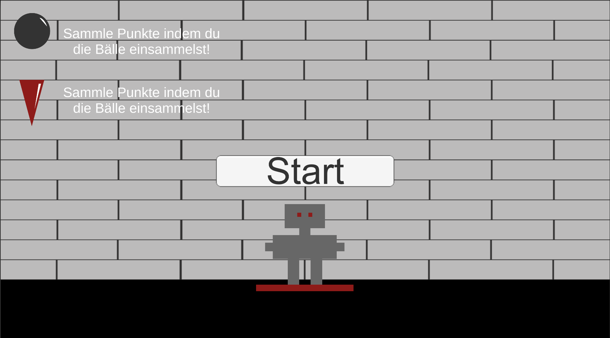
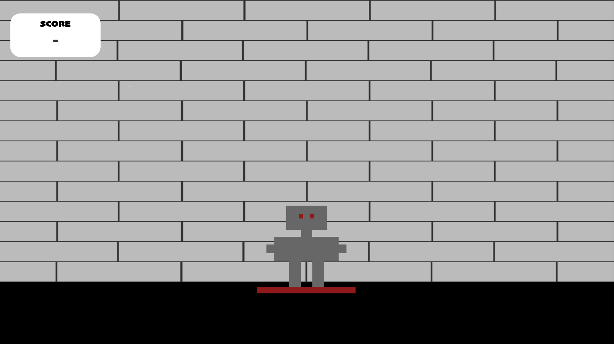
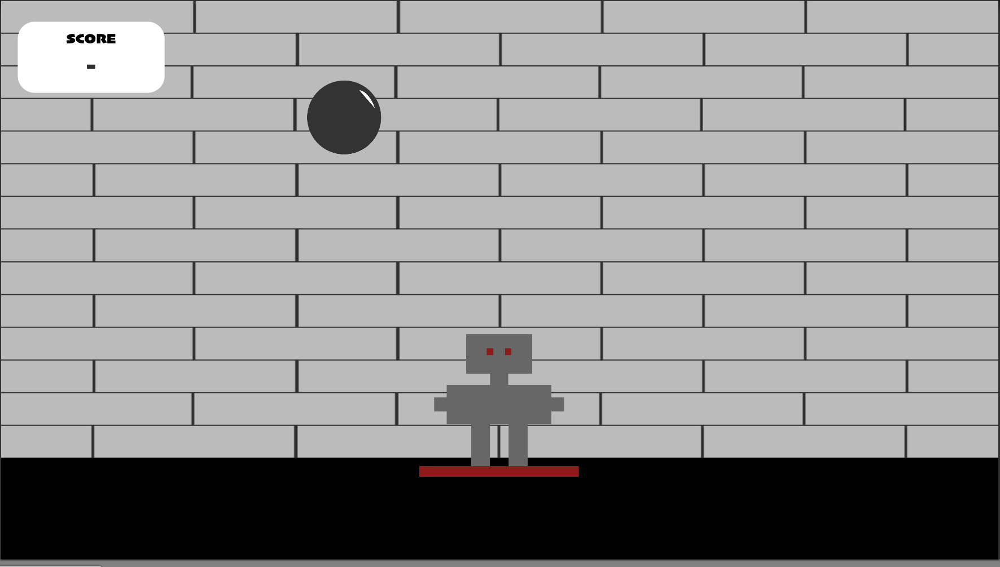
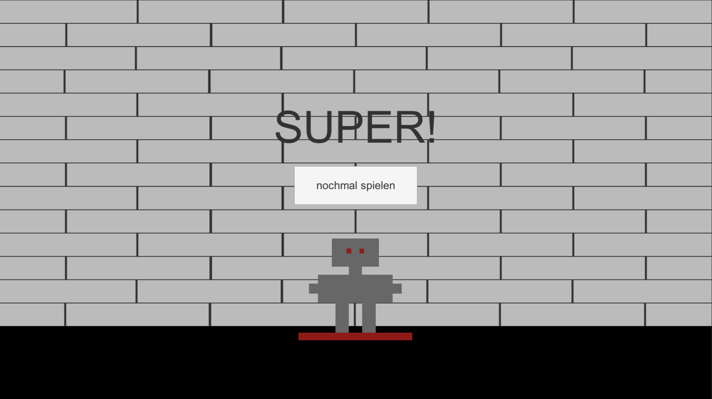
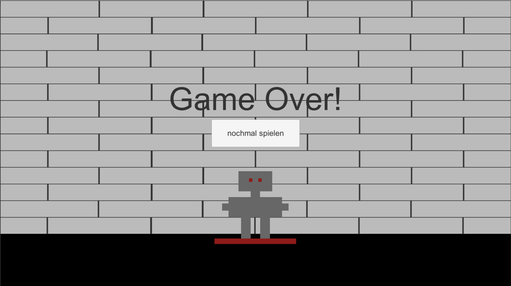

# BallCollect
Bei dem Minigame "BallCollect"handelt es sich um ein 2D Game und geht es darum mit den Roboter-Charakter so viele Bälle wie möglich zu fangen. Die Bälle die man fängt werden gezählt und bielden den Score des Spielers. Jedoch fallen nicht nur Bälle herunter sondern auch gefährliche Spitzen. Trifft den Charakter eine Spitze, verliert man Scorepunkte. 1 Treffer= -1 Punkt. Ziel ist es nach 60 sec. einen höchstmöglichen Score zu haben.

Progress in %: 70%

Das Konzept ist fertig.
Die Grafiken sind erstellt.
Das Projekt ist in Unity angelegt.
Der Charakter bewegt sich.(Code inspiriert von Caro Hollweger)
Man kan den Ball mit dem Charakter auffangen.
Wird der Ball nicht gefangen wird der Ball "zerstört".
Die Bälle spawnen. (Code inspiriert von Sarah Glavan)
Die Spitzen spawnen.

Developmentplattform: Unity Version 2018.2.14f1 
 
Visualstudio 7.7
 
Betriebssystem: macOS Mojave 10.14.1
 
Targetplattform: Computer 16:9 mit einer Auflösung von 1920,1080 
 
GameControl: arrow keys
 
Scripting Runtime Version: .NET 3.5 Equivalent
 
API Compatibility Level: .NET 2.0 Subset
 
Limitations: Counter not working, Spitzen not collectable
 
Lessons Learned: set scenes, set collider, charakter controlling, spawning random objects

 
Trailer of the Game:
 
<a href="https://youtu.be/jJL9thN-C00">Link to trailer.</a>
 
Startscreen

 
Mainscreen

 
Playscreen

 
Won screen

 
GameOver screen

 
 
©Anna Wenger